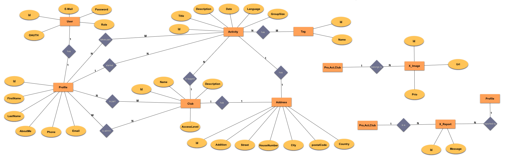
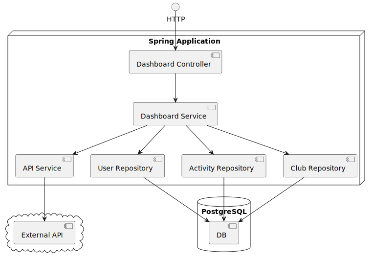

# OTHivity

Our idea is to build a platform for our university, OTH Regensburg, where students can post activities,
connect with others and find new people to engage with.

## API Documentation

This API uses **JWT (JSON Web Token)** for authentication:

1.  **Get your Token:** You can generate your personal JWT in the application GUI under **Settings**.
2.  **Usage:** The token must be included in the HTTP `Authorization` header with the `Bearer` schema.

**Header Example:**
```http
Authorization: Bearer <YOUR_JWT_TOKEN>
```

`401 UNAUTHORIZED` → Invalid or missing JWT token

### Data Model: `ActivityApiDto`

**Base URL:** `/api/activities`

| Field         | Type              | Description                                                        | Create   | Update                              |
|---------------|-------------------|--------------------------------------------------------------------|----------|-------------------------------------|
| `id` | `String (UUID)` | activity identifier (response only)                                | -        | -                                   |
| `title` | `String` | activity title                                                     | required | required                            |
| `description` | `String` | activity description                                               | required | required                            |
| `date` | `String (ISO-8601)` | activity date example: `2025-01-15T18:30:00`.                      | required | required                            |
| `language` | `String (Enum)` | activity language one of: `ENGLISH`, `GERMAN`, `FRENCH`, `SPANISH` | required | required                            |
| `groupSize` | `int` | activity groupsizee must be ≥ 2                                    | required | required                            |
| `organizerId` | `String (UUID)` | club as orgaizer must refer to an existing club                    | optional | optional                            |
| `imageUrl` | `String` | activity image                                                     | required | required                            |
| `tags` | `String[]` | activity tagse one of: (e.g. `OUTDOOR`, `SPORTS`)                  | optional | optional                                 |
| `startedBy` | `String (UUID)` | activity starter = profile uuid                                    | -        | required                            |
| `takePart` | `String[] (UUID)` | activity participants = prrofil uuids                              | optional | required + must include `startedBy` |
| `addition` | `String` | address addition                                                   | optional | optional                            |
| `street` | `String` | address street                                                     | required      | required                                 |
| `houseNumber` | `String` | address housenumber                                                | required      | required                                 |
| `postalCode` | `String` | address postal code                                                | required      | required                                 |
| `city` | `String` | address city                                                       | required      | required                                 |
| `country` | `String` | address country                                                    | optional | optional                            |
| `latitude` | `String` | adress latitude (response only).                                   | -        | -                                   |
| `longitude` | `String` | adress longitude (response only).                                  | -        | -                                   |

#### ENUMS
- `language`:
    - `ENGLISH`
    - `GERMAN`
    - `FRENCH`
    - `SPANISH`
- `tags`:
    - `OUTDOOR` 🌲
    - `INDOOR` 🏠
    - `SPORTS` 🏃
    - `LEARNING` 📚
    - `PARTY` 🎉
    - `MUSIC` 🎶
    - `FOOD` 🍽️
    - `TRAVEL` ✈️
    - `HIKING` 🥾
    - `ART` 🎨
    - `RELAX` 🛋️
    - `VOLUNTEERING` 🤝
    - `BOARDGAME` 🎲
    - `GAMING` 🎮
    - `MOVIE` 🎬
    - `SOCIAL` 👥


### Endpoints

#### GET `/api/activities`

Returns all activities.

**Response:**  
`200 OK` → `List<ActivityApiDto>`

---

#### GET `/api/activities/{id}`

Returns one activity by its id.

**Response:**

`200 OK` → `ActivityApiDto`

`404 NOT FOUND` → Activity not found

---

#### POST `/api/activities`

Creates a new activity.

**Responses:**

`201 CREATED` -> `ActivityApiDto`

`400 BAD REQUEST` → Validation errors

`403 Forbidden` → Insufficient permissions

**Example Request:**
```json
{
  "title": "Hiking Trip",
  "description": "A fun group hike.",
  "date": "2025-05-21T10:00:00",
  "language": "ENGLISH",
  "groupSize": 10,
  "organizerId": "b32ef0c3-2b44-4f18-9cd5-6a93d9d67188",
  "imageUrl": "https://example.com/image.jpg",
  "tags": ["OUTDOOR", "HIKING"],
  "takePart": ["77d8ca72-0cd6-4a4a-9f70-4d923f6c1432"],
  "street": "Main Street",
  "houseNumber": "5A",
  "postalCode": "93047",
  "city": "Regensburg",
  "country": "Germany"
}
```
---

#### PUT `/api/activities/{id}`

Updates an existing activity.
Only the creator (`startedBy`) or users with the role `MODERATOR` are allowed to update.

**Responses:**

`200 SUCCESS` -> `ActivityApiDto`

`404 NOT FOUND` → Activity not found

`400 BAD REQUEST` → Validation errors

`403 Forbidden` → Insufficient permissions

**Example Request:**
```json
{
  "title": "Hiking Trip",
  "description": "A fun group hike.",
  "date": "2025-05-21T10:00:00",
  "language": "ENGLISH",
  "groupSize": 12,
  "organizerId": "b32ef0c3-2b44-4f18-9cd5-6a93d9d67188",
  "imageUrl": "https://example.com/image.jpg",
  "tags": ["OUTDOOR", "HIKING"],
  "startedBy": "77d8ca72-0cd6-4a4a-9f70-4d923f6c1432",
  "takePart": ["77d8ca72-0cd6-4a4a-9f70-4d923f6c1432"],
  "street": "Main Street",
  "houseNumber": "5A",
  "postalCode": "93047",
  "city": "Regensburg",
  "country": "Germany"
}
```
---

#### DELETE `/api/activities/{id}`
Deletes an existing activity.
Only the creator (`startedBy`) or users with the role `MODERATOR` are allowed to delete.

**Responses:**

`204 NO CONTENT` → Activity deleted successfully

`404 NOT FOUND` → Activity not found

`403 Forbidden` → Insufficient permissions

---

### Data Model: `ClubApiDto`

**Base URL:** `/api/clubs`

| Field | Type | Description | Create | Update |
|---|---|---|---|---|
| `id` | `String (UUID)` | club identifier (response only) | - | required |
| `name` | `String` | club name | required | required |
| `description` | `String` | club description | required | required |
| `accessLevel` | `String (Enum)` | club access level: `OPEN`, `PRIVATE`, `PUBLIC` | required | required |
| `imageUrl` | `String` | club image URL | optional | optional |
| `admins` | `String[] (UUID)` | club admin profile UUIDs (response only) | - | - |
| `members` | `String[] (UUID)` | club member profile UUIDs (response only) | - | - |
| `addition` | `String` | address addition | optional | optional |
| `street` | `String` | address street | required | required |
| `houseNumber` | `String` | address house number | required | required |
| `postalCode` | `String` | address postal code | required | required |
| `city` | `String` | address city | required | required |
| `country` | `String` | address country | optional | optional |
| `latitude` | `String` | address latitude (response only) | - | - |
| `longitude` | `String` | address longitude (response only) | - | - |

#### ENUMS
- `accessLevel`:
    - `OPEN` - Anyone can join
    - `PRIVATE` - Invitation only
    - `PUBLIC` - Visible to all, requires approval to join

### Endpoints

#### GET `/api/clubs`

Returns all clubs.

**Response:**  
`200 OK` → `List<ClubApiDto>`

---

#### GET `/api/clubs/{id}`

Returns one club by its ID.

**Response:**

`200 OK` → `ClubApiDto`

`404 NOT FOUND` → Club not found

---

#### POST `/api/clubs`

Creates a new club. The creator automatically becomes an admin.

**Responses:**

`201 CREATED` → `ClubApiDto`

`400 BAD REQUEST` → Validation errors

**Example Request:**
```json
{
  "name": "Hiking Club",
  "description": "A club for hiking enthusiasts",
  "accessLevel": "OPEN",
  "imageUrl": "https://example.com/club.jpg",
  "street": "University Street",
  "houseNumber": "10",
  "postalCode": "93053",
  "city": "Regensburg",
  "country": "Germany"
}
```

---

#### PUT `/api/clubs/{id}`

Updates an existing club.
Only club admins or users with the role `MODERATOR` are allowed to update.

**Responses:**

`200 OK` → `ClubApiDto`

`400 BAD REQUEST` → Validation errors

`403 FORBIDDEN` → Insufficient permissions (not an admin)

`404 NOT FOUND` → Club not found

**Example Request:**
```json
{
  "id": "ffcbf39a-5839-4937-8fe1-7bb40499d678",
  "name": "Updated Hiking Club",
  "description": "Updated description",
  "accessLevel": "PUBLIC",
  "imageUrl": "https://example.com/new-image.jpg",
  "street": "University Street",
  "houseNumber": "10",
  "postalCode": "93053",
  "city": "Regensburg",
  "country": "Germany"
}
```

---

#### DELETE `/api/clubs/{id}`

Deletes an existing club.
Only club admins or users with the role `MODERATOR` are allowed to delete.

**Responses:**

`204 NO CONTENT` → Club deleted successfully

`403 FORBIDDEN` → Insufficient permissions (not an admin)

`404 NOT FOUND` → Club not found

---

### Data Model: `ProfileApiDto`

**Base URL:** `/api/profiles`

| Field | Type | Description | Create | Update |
|---|---|---|---|---|
| `id` | `String (UUID)` | profile identifier (response only) | - | - |
| `username` | `String` | unique username | required | - |
| `email` | `String` | unique email address | required | - |
| `firstName` | `String` | first name | required | - |
| `lastName` | `String` | last name | required | - |
| `password` | `String` | password (write-only) | required | - |
| `aboutMe` | `String` | profile description | optional | optional |
| `phone` | `String` | phone number | optional | optional |
| `imageUrl` | `String` | profile image url | optional | optional |
| `language` | `String (Enum)` | language preference | optional | optional |
| `theme` | `String (Enum)` | theme preference | optional | optional |

#### ENUMS
- `language`:
    - `ENGLISH`
    - `GERMAN`
    - `FRENCH`
    - `SPANISH`
- `themes`:
    - `LIGHT` ☀️
    - `DARK` 🌑
    - `CUPCAKE` 🧁
    - `BUMBLEBEE` 🐝
    - `EMERALD` ✳️
    - `CORPORATE` 🏢
    - `SYNTHWAVE` 🌃
    - `RETRO` 📼
    - `CYBERPUNK` 🤖
    - `VALENTINE` 🌸
    - `HALLOWEEN` 🎃
    - `GARDEN` 🌷
    - `FOREST` 🌲
    - `AQUA` 💧
    - `LOFI` 📻
    - `PASTEL` 🎨
    - `FANTASY` 🧚
    - `WIREFRAME` 📝
    - `BLACK` 🖤
    - `LUXURY` 💎
    - `DRACULA` 🧛
    - `CMYK` 🖨️
    - `AUTUMN` 🍂
    - `BUSINESS` 💼
    - `ACID` 🧪
    - `LEMONADE` 🍋
    - `NIGHT` 🌙
    - `COFFEE` ☕
    - `WINTER` ❄️
    - `DIM` 🔅
    - `NORD` ❄️
    - `SUNSET` 🌅

### Endpoints

#### GET `/api/profile/all`
Returns a list of all profiles.

**Response:**

`200 OK` → `List<ProfileApiDto>`

---

#### GET `/api/profile/me`
Returns the profile of the currently authenticated user.

**Response:**

`200 OK` → `ProfileApiDto`

`404 NOT FOUND` → Profile not found

---

#### GET `/api/profile/{username}`
Returns a specific profile by username.
Requires `MODERATOR` or `ADMIN` role.

**Response:**

`200 OK` → `ProfileApiDto`

`403 FORBIDDEN` → Insufficient permissions

`404 NOT FOUND` → Profile not found

---

#### POST `/api/profile`
Creates a new profile (and user account).
Requires `MODERATOR` or `ADMIN` role.

**Response:**

`201 CREATED` → `ProfileApiDto`

`400 BAD REQUEST` → Validation errors

`403 FORBIDDEN` → Insufficient permissions

`409 CONFLICT` → Email or Username already taken

**Example Request:**
```json
{
  "username": "newuser",
  "email": "user@example.com",
  "password": "securePassword123",
  "firstName": "Max",
  "lastName": "Mustermann",
  "imageUrl": "https://example.com/image.jpg",
  "language": "ENGLISH",
  "theme": "DARK"
}
```

---

#### PUT `/api/profile/{username}`
Updates an existing profile.
Allowed for the profile owner, `MODERATOR`, or `ADMIN`.
Note: `username`, `email`, `firstName`, and `lastName` cannot be changed via this endpoint.

**Response:**

`200 OK` → `ProfileApiDto`

`400 BAD REQUEST` → Validation errors

`403 FORBIDDEN` → Insufficient permissions

`404 NOT FOUND` → Profile not found

**Example Request:**
```json
{
  "aboutMe": "Updated description",
  "theme": "LIGHT",
  "phone": "+123456789"
}
```

---

#### DELETE `/api/profile/{username}`
Deletes a profile.
Allowed for the profile owner, `MODERATOR`, or `ADMIN`.

**Response:**

`204 NO CONTENT` → Success

`403 FORBIDDEN` → Insufficient permissions

`404 NOT FOUND` → Profile not found

---

## Profile API Documentation

**Base URL:** `/api/profile`

Authentication via JWT is required (see Activity API).

### Data Model: `ProfileApiDto`

| Field | Type | Description | Create | Update |
|---|---|---|---|---|
| `id` | `String (UUID)` | profile identifier (response only) | - | - |
| `username` | `String` | unique username | required | - |
| `email` | `String` | unique email address | required | - |
| `firstName` | `String` | first name | required | - |
| `lastName` | `String` | last name | required | - |
| `password` | `String` | password (write-only) | required | - |
| `aboutMe` | `String` | profile description | optional | optional |
| `phone` | `String` | phone number | optional | optional |
| `imageUrl` | `String` | profile image url | optional | optional |
| `language` | `String (Enum)` | language preference | optional | optional |
| `theme` | `String (Enum)` | theme preference | optional | optional |

#### ENUMS
- `language`:
    - `ENGLISH`
    - `GERMAN`
    - `FRENCH`
    - `SPANISH`
- `themes`:
    - `LIGHT` ☀️
    - `DARK` 🌑
    - `CUPCAKE` 🧁
    - `BUMBLEBEE` 🐝
    - `EMERALD` ✳️
    - `CORPORATE` 🏢
    - `SYNTHWAVE` 🌃
    - `RETRO` 📼
    - `CYBERPUNK` 🤖
    - `VALENTINE` 🌸
    - `HALLOWEEN` 🎃
    - `GARDEN` 🌷
    - `FOREST` 🌲
    - `AQUA` 💧
    - `LOFI` 📻
    - `PASTEL` 🎨
    - `FANTASY` 🧚
    - `WIREFRAME` 📝
    - `BLACK` 🖤
    - `LUXURY` 💎
    - `DRACULA` 🧛
    - `CMYK` 🖨️
    - `AUTUMN` 🍂
    - `BUSINESS` 💼
    - `ACID` 🧪
    - `LEMONADE` 🍋
    - `NIGHT` 🌙
    - `COFFEE` ☕
    - `WINTER` ❄️
    - `DIM` 🔅
    - `NORD` ❄️
    - `SUNSET` 🌅

### Endpoints

#### GET `/api/profile/all`
Returns a list of all profiles.

**Response:**

`200 OK` → `List<ProfileApiDto>`

---

#### GET `/api/profile/me`
Returns the profile of the currently authenticated user.

**Response:**

`200 OK` → `ProfileApiDto`

`404 NOT FOUND` → Profile not found

---

#### GET `/api/profile/{username}`
Returns a specific profile by username.
Requires `MODERATOR` or `ADMIN` role.

**Response:**

`200 OK` → `ProfileApiDto`

`403 FORBIDDEN` → Insufficient permissions

`404 NOT FOUND` → Profile not found

---

#### POST `/api/profile`
Creates a new profile (and user account).
Requires `MODERATOR` or `ADMIN` role.

**Response:**

`201 CREATED` → `ProfileApiDto`

`400 BAD REQUEST` → Validation errors

`401 UNAUTHORIZED` → Authentication required

`409 CONFLICT` → Email or Username already taken

**Example Request:**
```json
{
  "username": "newuser",
  "email": "user@example.com",
  "password": "securePassword123",
  "firstName": "Max",
  "lastName": "Mustermann",
  "imageUrl": "https://example.com/image.jpg",
  "language": "ENGLISH",
  "theme": "DARK"
}
```

---

#### PUT `/api/profile/{username}`
Updates an existing profile.
Allowed for the profile owner, `MODERATOR`, or `ADMIN`.
Note: `username`, `email`, `firstName`, and `lastName` cannot be changed via this endpoint.

**Response:**

`200 OK` → `ProfileApiDto`

`400 BAD REQUEST` → Validation errors

`403 FORBIDDEN` → Insufficient permissions

`404 NOT FOUND` → Profile not found

**Example Request:**
```json
{
  "aboutMe": "Updated description",
  "theme": "LIGHT",
  "phone": "+123456789"
}
```

---

#### DELETE `/api/profile/{username}`
Deletes a profile.
Allowed for the profile owner, `MODERATOR`, or `ADMIN`.

**Response:**

`204 NO CONTENT` → Success

`403 FORBIDDEN` → Insufficient permissions

`404 NOT FOUND` → Profile not found

---

## Architecture Concepts

Before starting to code, we entered the concept phase to carefully plan every aspect according to our needs.
The following examples, diagrams, and notes reflect our thought process during this stage.

### Database

The following diagram provides an overview of the database structure used in OTHivity.
It visualizes all core entities and the relationships between them.


### GET Request Example on `/dashboard`

The following diagram illustrates an HTTP GET request to `/dashboard`.  
The focus here is on the structure of the different services and how they interact with each other.

